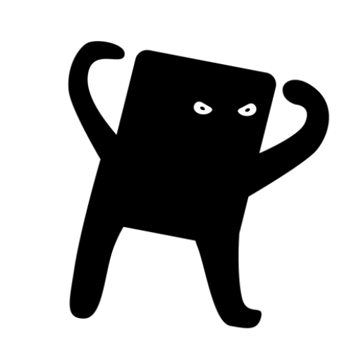

# VDroid Scripter



**VDroid Scripter** stands for "Visual Android Scripter".

This is a tool for remotely controlling Android devices and creating automation scripts using computer vision without requiring users to manually write code or commands.

The project consists of three main components:
<br clear="left"/>

* **Server**
  A Golang-based microservice that owns everything heavy: ADB and [scrcpy-server](https://github.com/Genymobile/scrcpy/tree/master/server) management, H.264 video decoding, computer vision, OCR, the library storage, and the HTTP API. It runs on Linux and macOS.

* **Android client**
  An example Android application that connects to the server. It is the curator's seat: it streams the device screen, crops template images, records gestures, and runs saved actions and routes. The client can be **any application capable of decoding H.264 streams and handling input events (e.g., clicks, gestures)**.

* **MCP server**
  A small Go program in `mcp_server/` that exposes the server's HTTP API as [MCP](https://modelcontextprotocol.io) tools, so an AI agent (Claude Code, opencode, ...) can drive devices with natural-language flows. It is just another client: no CV libraries, only Go. It starts `vdroid-scripter` on demand, so no separate terminal is needed.

## Contents

* [How it works](#how-it-works)
* [Installation](#installation)
* [Preparing the Android device](#preparing-the-android-device)
* [Running the server](#running-the-server)
* [Android client](#android-client)
* [MCP server](#mcp-server)
* [Recording gestures](#recording-gestures)
* [API reference](#api-reference)
* [Device compatibility](#device-compatibility)
* [Network and security](#network-and-security)
* [Project status](#project-status)

## How it works

The server never needs coordinates from you. It finds things on the live screen and acts on what it found.

### The library

A human curates a small library of named resources, stored as plain files on the server:

* **Images** are template crops taken from the device screen, for example an icon that has no text.
* **Actions** are recorded gestures, for example an app-specific swipe or a drag.

Names are flat and unique per kind. The convention is to put the context into the name, `<app>_<screen>_<what>[_variant]`, for example `shop_catalog_swipe_1`. Saving under an existing name overwrites it.

### Steps

A **step** is the runtime unit: one event applied to a target found on screen.

```json
{ "event": "tap", "landmarks": [{ "type": "text", "value": "Checkout", "locale": "eng" }], "timeout": 5000, "delay": 1000 }
```

The target is a chain of **landmarks**. Each landmark is one thing the server can locate:

| Landmark type | How it is found |
| ------------- | --------------- |
| `image` | OpenCV template match of the library image named in `value` |
| `text` | Tesseract OCR for `value`, in the language given by `locale` |
| `yolo` | YOLO detections whose class matches `value` |

The whole chain resolves on a single video frame. The first landmark takes its first match, every following landmark takes the match nearest to the previous one, and the event applies to the last landmark. One landmark is the normal case. A second one in front disambiguates duplicates, as in "the toggle next to *Show refresh rate*".

The `event` decides what happens at the target:

| Event | Effect |
| ----- | ------ |
| `tap`, `long_tap` | A generated touch at a random point inside the found region |
| `swipe_up`, `swipe_down`, `swipe_left`, `swipe_right` | A generated human-like swipe, named by the finger's direction. Landmarks are optional |
| `type_text` | Types the last landmark's `value` on the open on-screen keyboard. The landmark's `locale` names the keyboard language |
| a library action name | Replays that recorded gesture, moved into the found region when the step has a target, verbatim otherwise |
| empty | A pure visibility check of the target, no touch |

`delay` is slept before the step acts and `timeout` is how long the server keeps looking for the target. Both are milliseconds and both are taken literally.

Typing is dynamic: nothing about keyboards is stored. When a `type_text` step runs, the keyboard must already be open (tap the field first). The server reads the keyboard's letter rows off the live frame, recognises them by the row patterns of the landmark's `locale` (QWERTY for `eng`, AZERTY for `fra`, QWERTZ for `deu`, ЙЦУКЕН for `rus`, and the other European layouts), and taps the keys. Letters, space and, when the keyboard shows a number row, digits can be typed, and capitals go through Shift. Punctuation and symbols are not supported yet and fail the step. For number and phone fields use the locale `numeric`: the server then looks for the numeric keypad (`123`, `456`, `789` and `0`) instead of letters, whether it is the keyboard's keypad or the app's own dial pad. The keyboard has to be showing the language of the step; switching languages is up to the flow.

### Sessions and the queue

Each device has a session with a step queue. Queue steps with `POST /devices/{serial}/queue_steps` and the server opens the session by itself, runs the steps in order, and reports progress through the session status: `closed`, `idle`, `recording`, `running <step>`, or an error text naming the target that could not be found. Steps run headless, so no client has to be connected.

### Scan

`GET /devices/{serial}/scan` looks at one frame and returns every landmark it can name: all readable text, all YOLO detections, and matches for the library images you list. The result uses the same vocabulary steps consume, which is what lets an AI agent work without ever seeing a screenshot.

### Routes

A **route** is a saved flow: a name, the steps that worked, and optionally the prompt the flow was dictated with. Run one with a single call, or start it from a specific step id. The server holds no flow logic of its own. Conditions and recovery live in whoever is driving it.

## Installation

From the project root, run:

```bash
./install.sh
```

The script installs the build toolchain and ADB (Go, ADB, pkg-config, CMake, Ninja, NASM and a C++ compiler), builds OpenCV, FFmpeg, Leptonica and Tesseract from pinned source releases as static libraries into `build/deps`, builds the server against them, and installs the `vdroid-scripter` binary to `/usr/local/bin`. The library builds run once (ten to fifteen minutes on a modern machine) and are reused by later runs. Supported out of the box: macOS (Homebrew), Arch, Debian/Ubuntu, and Fedora. On another distribution install the toolchain yourself and run `VDROID_SKIP_PACKAGES=1 ./install.sh`.

By default the binary goes to `/usr/local/bin`, and the script uses `sudo` only if that directory is not writable. Set `PREFIX` to install somewhere else. The binary is placed in `$PREFIX/bin`:

```bash
PREFIX="$HOME/.local" ./install.sh
```

If `$PREFIX/bin` is not on your `PATH`, the script prints the `export PATH=...` line to add to your shell profile.

### Notes on the native dependencies

* The server binary is self-contained. `install.sh` does not use the distribution's OpenCV, FFmpeg or Tesseract packages: it downloads pinned source releases (OpenCV 4.14.0, FFmpeg 9.0.2, Leptonica 1.87.0, Tesseract 5.5.3), builds each as static libraries with only what the server uses, and links them into `vdroid-scripter`. `ldd` or `otool -L` on the result shows system libraries only, so a distribution upgrade that changes an OpenCV, OpenEXR or FFmpeg version cannot break it. The reason this matters: gocv needs OpenCV 4 while Arch and Homebrew now ship OpenCV 5 as `opencv`, and community packages of OpenCV 4 broke whenever a library they were built against moved on.
* The builds live in `build/deps` (override with `VDROID_DEPS`). OpenCV contains the modules gocv's wrapper compiles against, with no OpenEXR, FFmpeg, GUI or contrib support; FFmpeg is libavcodec with the H.264 decoder only; Leptonica and Tesseract are built without image codecs, libarchive or curl. Bump a version constant at the top of `install.sh` and re-run it to rebuild one of them.
* Tesseract language files live in `$PREFIX/share/vdroid_scripter/tessdata` (`/usr/local/share/vdroid_scripter/tessdata` by default); that path is compiled into the server, so it needs no environment variable. The script downloads `eng` and `rus` from the [tessdata](https://github.com/tesseract-ocr/tessdata) repository (about 20 MB each). Set `VDROID_TESSDATA_LANGS="eng deu fra"` before running the script to fetch other languages, or drop any `<lang>.traineddata` into that directory later. `TESSDATA_PREFIX` in the environment overrides the directory at run time, as with any Tesseract build. Changing `PREFIX` rebuilds Tesseract, because the path is baked in.

## Preparing the Android device

Before connecting a device to the server, set it up for remote control:

1. Open **Settings** on the Android device.
2. Enable **Developer Options**, usually by tapping *Build Number* seven times in "About Phone".
3. Inside Developer Options, enable **USB Debugging**.
4. Connect the device to your computer with a USB cable.
5. Accept the **RSA fingerprint / ADB debugging authorization** prompt on the device.
6. Check that the device is detected:

```bash
adb devices
```

An emulator works the same way and needs no setup.

## Running the server

Connect a device and start the server:

```bash
vdroid-scripter
```

It listens on port `8080`. If you use the MCP server you can skip this step, because it starts `vdroid-scripter` by itself.

### Running from source

```bash
cd server && go run cmd/main.go
```

Building or running from source needs the static libraries that `install.sh` built on the pkg-config path, so run the script once first. `install.sh` exports this itself when it builds:

```bash
export PKG_CONFIG_PATH="$PWD/build/deps/lib/pkgconfig"
```

### Configuration

Everything is optional. Settings are read from a `.env` file in the working directory, falling back to `~/.env`.

| Variable | Default | Meaning |
| -------- | ------- | ------- |
| `SERVER_PORT` | `:8080` | HTTP port |
| `SOCKET_PORT` | `3001` | Base port for the per-session video and control sockets |
| `BASE_PATH` | `vdroid_scripter` | Name of the data directory inside the user cache directory |
| `IMAGES_DIR` | `images` | Library images |
| `ACTIONS_DIR` | `actions` | Library actions |
| `ROUTES_DIR` | `routes` | Saved routes |
| `YOLO_DIR` | `yolo` | YOLO model files |
| `SCRCPY_DIR` | `scrcpy` | Downloaded scrcpy-server binaries |
| `LOGS` | `logs` | Log files |
| `SCRCPY_VERSION` | `3.3.4` | scrcpy-server version to download |

With the defaults the data directory is `~/Library/Caches/vdroid_scripter` on macOS and `~/.cache/vdroid_scripter` on Linux. The other directories in the table live inside it.

### YOLO model

Object detection is optional. To use `yolo` landmarks, drop an ONNX model as `best.onnx` together with its `obj.names` class list into the `yolo/` subdirectory of the data directory. Without those files YOLO detection quietly returns nothing, and `image` and `text` landmarks keep working.

## Android client

### Install

Build the app from `android_client/` with Android Studio, or download the APK from the [releases page](https://github.com/VaasKout/android_vision_scripter/releases). To install a downloaded APK:

* Enable installation from unknown sources, if required.
* Open the downloaded APK file.
* Install and launch the app.

The app runs on its own phone or tablet. It is not installed on the device being controlled.

### Connect to the server

The app asks for two values:

* **Server IP address**, the local network IP of the machine running the server.
* **Port number**, `8080` by default.

The server machine and the phone running the app must be on the same local network. To find the server's IP address:

```bash
ip a        # Linux, look for "inet 192.168.x.x" on wlan0 or eth0
ifconfig    # macOS, look for "inet 192.168.x.x" on en0
```

### Using the app

* **Devices tab.** Every device the server sees over ADB, with a Streaming button that opens the live screen. Streaming a device restarts its session and cancels whatever is running on it. This is the emergency stop for a route that must not continue.
* **Library tab.** Three cards: Images, Actions and Routes, each with a count. A card opens its list. Every row can be deleted, and action and route rows have a play button.
* **Play.** Tick a device in the bottom sheet and press Play. The last device used is preselected. A device that is already running something is grayed out with its status and cannot be ticked. An action runs as a single verbatim gesture, a route runs from its first step. The row then shows the live status and the device, while its play button stays available for other devices. On an error the server's text stays on the row until you tap it.
* **Streaming screen.** The plus icon crops a template image or records a gesture. The magnifying glass scans the screen for text (green boxes), YOLO classes (yellow) and, optionally, your library images (magenta), each box labelled with its value. The eye shows the rectangles the server detects, fetched once per tap.

## MCP server

`mcp_server/` is its own Go module. It needs only Go, none of the CV native libraries:

```bash
cd mcp_server && go build -o vdroid-mcp .
```

The `-o` flag is required. Without it the default output name collides with the `mcp_server` directory. Register the binary with your MCP client, for example with Claude Code:

```bash
claude mcp add vdroid -- <path>/vdroid-mcp
```

| Variable | Default | Meaning |
| -------- | ------- | ------- |
| `VDROID_URL` | `http://127.0.0.1:8080` | The vdroid server to talk to |
| `VDROID_BIN` | `vdroid-scripter` on `PATH`, then `/usr/local/bin`, then `/opt/homebrew/bin` | The server binary to launch on demand |

### Starting the server on demand

When a request fails, the MCP server checks `GET /ping` first. A healthy ping means the original error was genuine and is returned. An answer that is not vdroid is reported as a port conflict. When nothing answers at a local URL, it launches the server binary as a detached process, appends its output to `logs/server.log` in the data directory, waits up to 15 seconds for `/ping`, gives ADB device discovery up to 10 seconds more, and retries the request once. A remote `VDROID_URL` is never started automatically.

The server keeps running after the AI session ends, so later sessions find it already up. To stop it, ask the AI to stop the server, or run `pkill vdroid-scripter`. Either way the server closes every device session before it exits. There is deliberately no HTTP shutdown endpoint, because the API is unauthenticated.

### Tools

| Tool | Purpose |
| ---- | ------- |
| `ping` | Check that the server is reachable, starting it when it is not |
| `list_devices` | Connected devices and their serials |
| `get_library` | Names of the library images and actions |
| `scan` | The agent's only perception: the landmarks on the current screen, one `type left,top,right,bottom value` line each |
| `queue_steps` | Queue a whole sequence of steps in one call |
| `wait_for_session` | Block until the queue finishes, then report `idle` or the error |
| `get_session_status` | The current session status |
| `close_session` | Close the device session |
| `record_action` | Record a gesture the human performs on the device, see below |
| `get_routes`, `get_route` | List and read saved routes |
| `save_route`, `delete_route` | Save or remove a route |
| `run_route` | Queue a saved route, optionally from a given step id |
| `stop_server` | Stop the local server process |

### Talking to the agent

Once the MCP server is registered, describe the flow in plain words. The agent turns it into steps:

* "Open Settings, go to Network and internet, then tap Wi-Fi."
* "Tap the cart icon, swipe up twice, then tap Checkout."
* "Type hello into the search field."
* "If the Accept button is visible, tap it. Then open the menu."
* "Save this flow as `shop_checkout`." and later "Run `shop_checkout` on the emulator."
* "Record a gesture as `gallery_photo_drag_1`." The agent starts a 5 second window, and you perform the gesture on the device.

Anything written on the screen needs nothing from the library. Text landmarks and the generated events cover it. The library is only needed for a target with no readable text, such as an icon, and for a recorded gesture.

### How the agent is instructed

The MCP server ships its own instructions to the AI, so you do not have to explain the tool. In short:

* **Start with `ping`**, then `list_devices` for a serial. `ping` brings the server up when it is down.
* **Batch.** A dictated sequence becomes one `queue_steps` call followed by one `wait_for_session`. The agent does not queue step by step and does not poll the status in between.
* **Text is free.** An instruction phrased in words visible on screen is a chain of `tap` steps with `text` landmarks.
* **Locale.** Text landmarks and `type_text` carry the Tesseract language code of their value, `eng` by default. Text is passed exactly as written, never transliterated or translated.
* **Perception.** `scan` is the only way to look at the screen, and there are no screenshots. The agent scans when a step failed, when the instruction is conditional, or when you ask what is on screen. It does not scan habitually between steps. The MCP hands the agent a compact table rather than the server's JSON, and leaves out text the OCR read with confidence below 40 (icon glyphs and stray punctuation), saying how many entries it dropped.
* **Literal execution.** The agent queues exactly what you asked, as many times as you asked, with no added checks and no substitutions. It improvises only after a step fails.
* **Duplicates.** When a value matches several places, the agent puts a unique nearby landmark first in the chain. With no such neighbour, the first match in reading order wins.
* **Timing.** An omitted `delay` becomes 0 on the first step of a batch and 1000 ms on later steps. An omitted `timeout` becomes 5000 ms. The agent raises the timeout for targets that appear after a launch or a load.
* **Recovery.** A failed step clears the rest of the queue and names the target it could not find. The agent scans, applies your instruction or the route's prompt to what it sees, then queues the remaining steps again from the failed one.
* **Routes.** A route is saved only when you ask, with your dictation kept verbatim as its prompt. After a recovered run the agent asks before updating the route.
* **Curation.** Library images come only from the Android client. Actions come from the client or from `record_action`, and only when you ask for a recording.
* **No adb.** The agent never drives the device with `adb` directly. Every interaction is a step.

## Recording gestures

A library action can be recorded in two ways.

* **In the Android client.** On the streaming screen, press the plus icon, name the action, choose the custom action type, and perform the gesture on the streamed screen.
* **On the device itself.** `POST /devices/{serial}/record` with `{"name": "<action name>"}`, or the `record_action` MCP tool, listens to the device's touch panel for 5 seconds. Perform the gesture on the device right after the call. The reply is `200` when the action was saved and `204` when no touch happened in the window. Only the first finger is kept, and the device's natural orientation is assumed. While a device is recording, queueing steps on it is refused with `409`.

## API reference

The server exposes an HTTP API for devices, steps, the library, scan, routes, sessions and recording. See [docs/api.md](docs/api.md) for every endpoint, the request and response formats, and the data models.

## Device compatibility

⚠️ Not all Android devices are fully supported.

Some devices work with `scrcpy` only in **USB (OTG / ADB over USB) mode**, and on some of them **video streaming is not available** in that mode. This project relies on the screen stream for all of its computer vision, so such devices will **not work properly**.

Compatibility may depend on:

* Android version
* OEM restrictions (Samsung, Xiaomi, etc.)
* USB-only debugging limitations

## Network and security

⚠️ **Important:** the communication between the server and its clients is **not encrypted and not authenticated**. There is no TLS and there are no credentials.

This project is intended for a **trusted local network only**, such as:

* Personal home networks
* Development environments
* Isolated testing setups

Do not expose the server to the public internet or to untrusted networks. Screen frames and control commands can be intercepted, and anyone who can reach the port can control the connected devices. For remote use, add your own security layer such as a VPN or an SSH tunnel.

## Project status

This is **beta-1.0**. The core flow is in place, and the project may still contain bugs.
If you run into a problem, feel free to open an [issue](https://github.com/VaasKout/android_vision_scripter/issues).

## Acknowledgments

This project builds upon and would not be possible without the following open-source projects:

* [scrcpy](https://github.com/Genymobile/scrcpy) for Android screen streaming and control
* [gocv](https://github.com/hybridgroup/gocv) for OpenCV integration in Go
* [Tesseract](https://github.com/tesseract-ocr/tesseract) for OCR
* [FFmpeg](https://ffmpeg.org) for H.264 decoding

Huge thanks to the authors and contributors of these projects.

## Contact

If you have any questions, ideas, or would like to contribute to development, feel free to reach out:

**Email:** *VasyaKotov1@gmail.com*  
